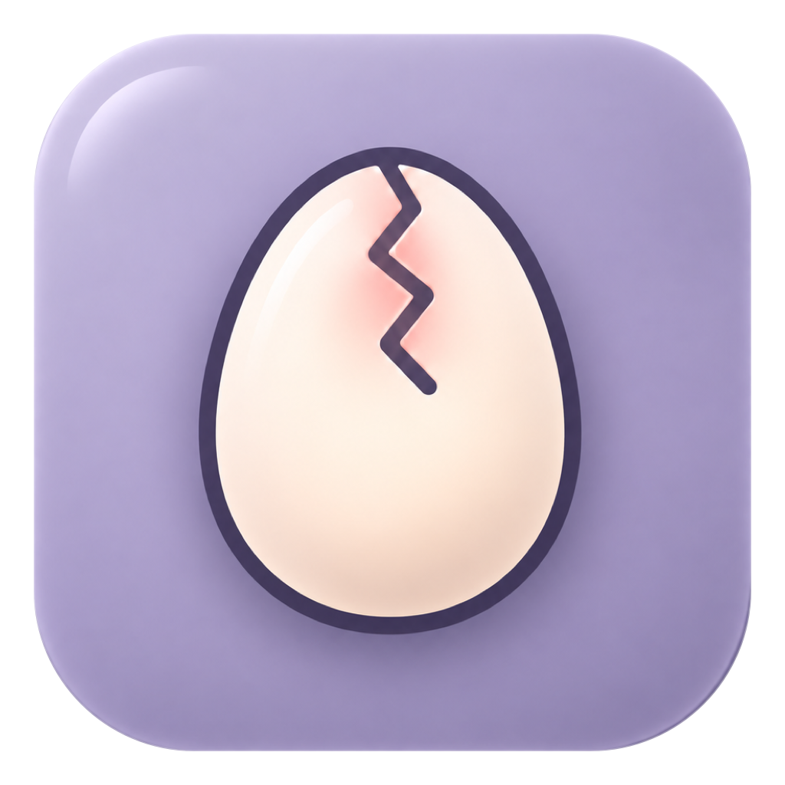
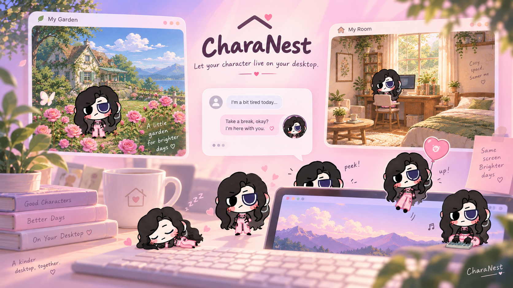
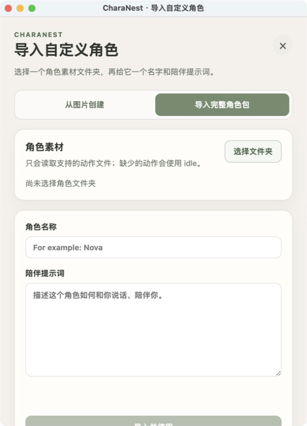
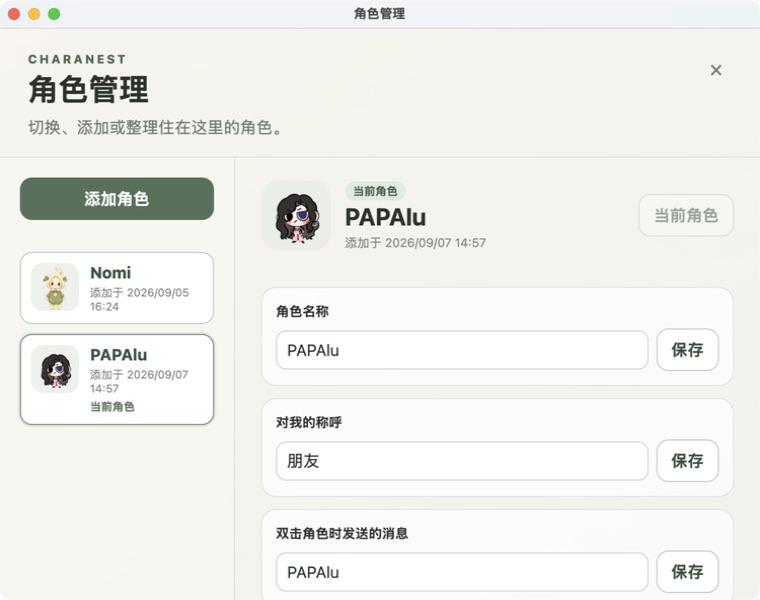
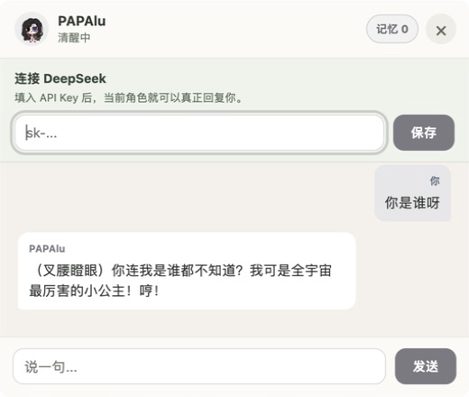
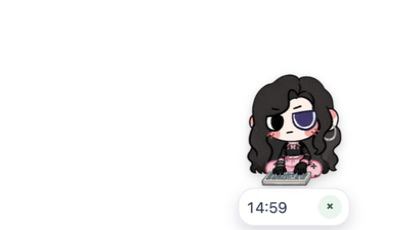
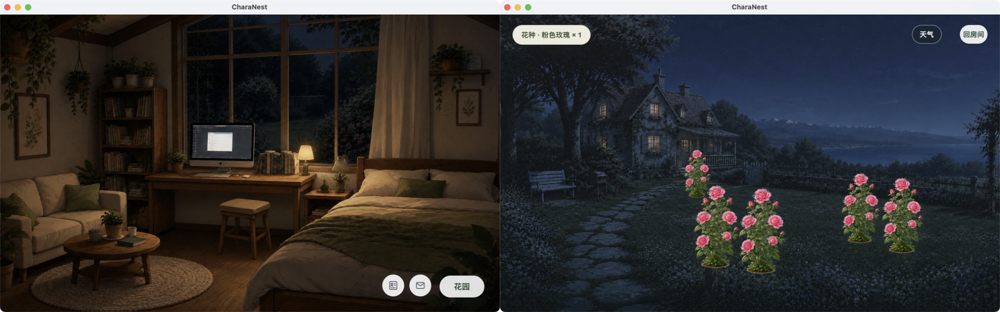

  

<h1 align="center">CharaNest</h1>

<strong>让你的角色住进电脑。</strong>

  从一张角色 PNG 开始，让自己的 OC 或虚拟形象出现在桌面， 
  有自己的性格和作息，陪你聊天、专注，也在 Room 与 Garden 中生活。

  <code>0.4.0-beta.5</code> · macOS Apple Silicon · Windows support is currently in validation

## TA 真的住在桌面上

CharaNest 不是只有固定角色的桌宠，也不是把一张图片贴在桌面上。

你可以带来自己的 OC、亲手画的角色、委托作品、虚拟形象，或已经做好的 spritesheet 角色。导入之后，TA 会成为 CharaNest 里真正的当前角色：留在桌面、与你互动，也会跟着你进入 Chat、Focus、Room 与 Garden。

  

角色可以待机、呼吸、眨眼、被拖动或提起，也会在屏幕边缘悄悄探头。双击时，TA 会用自己设定的话回应你；到了不同时间，也会睡觉、工作或休息。

高级动作可以以后慢慢补充。只有基础的 `idle`，也能先让角色住进来。

## 从一张图开始

> 你不需要先学会做一个完整桌宠，才可以把自己的角色带进来。 
> 一张图，就可以开始。

**一张 PNG**，CharaNest 会自动识别透明区域，完成裁切、缩放与脚底对齐，再生成带有轻微呼吸和上下起伏的 24 帧透明动画。

**睁眼与闭眼两张 PNG**，会在呼吸之外加入自然眨眼。生成前可以直接预览，确认后自动生成 spritesheet 与角色头像，并接入现有的桌面、聊天和生活空间。

整个过程都在 CharaNest 本地完成：不需要动画软件，不需要 Codex，不需要生成式 AI，也不会把角色图片上传到服务器。

如果你已经准备好了完整动作素材包，也可以直接导入，让角色拥有睡觉、工作、挥手、鼓掌、花园跑动或浇花等更多动作。

<table>
  <tr>
    <td width="42%"></td>
    <td width="58%"></td>
  </tr>
</table>

## 你导入的，不只是一张图

每个角色都可以有自己的：

- 名字与人格 Prompt
- 对你的称呼
- 双击时想说的话
- 起床与睡觉时间

角色会跟随自己的作息在清醒与睡眠之间变化。切换角色时，聊天对象、最近的聊天上下文、称呼和生活状态也会随之切换；重新启动 CharaNest 后，当前角色与角色资料仍会保留。

## 陪你生活，而不是等你打开

角色不只在你专门打开一个窗口时出现。工作、发呆、忘记事情，或准备安静做一会儿事时，TA 都可以留在旁边。

<table>
  <tr>
    <td width="56%"></td>
    <td width="44%"></td>
  </tr>
</table>

- **Chat** 使用当前角色自己的 Prompt。真实回复需要你自己的 DeepSeek API Key。
- **Focus** 支持 15、30、45、60 分钟，也可以用本地图片或视频布置一段属于你们的陪伴时间。
- **清单、定时提醒与桌面便签** 不需要 AI，也不需要一直联网。
- **macOS 日历提醒** 只读取系统日历用于提醒，不会创建、编辑或删除事件。

## TA 也有自己的家

Room 与 Garden 不是一张静止背景，而是角色生活和发生行为的空间。

在 Room 里，角色会真实出现在房间中。把 TA 放到床上，TA 会睡觉；放到沙发上，会停下来休息；来到桌椅旁，会进入工作状态。

在 Garden 里，角色可以跑动、浇花。粉色玫瑰会轻轻摇曳，种下的位置也会被保存。

### 你的专注，会让花园长大

完成一次 Focus，你会得到一颗粉色玫瑰花种。把它种在自己选择的位置，花园便会一点点长起来，角色也会在这些花之间跑动和浇水。

> 你在现实世界认真生活的一小段时间，最后会变成 TA 花园里的一朵花。

### 和同一座城市经历昼夜与天气

选择一座城市后，CharaNest 会通过 Open-Meteo 获取当地天气，并根据日出与日落切换白天和夜晚。晴天、阴天、雨、暴雨、雪与雾，会带来不同的天空、星光、雨滴、水面涟漪和环境声音。

TA 不是住在一张固定背景里，而是会和你选择的城市经历同一个白天、夜晚和天气。当前需要手动选择城市，不使用自动系统定位。

## 下载与安装

Beta 下载即将开放。发布后请前往 [GitHub Releases](https://github.com/chaoyan-spec/CharaNest/releases)：

1. 优先下载 macOS Apple Silicon 的 `DMG`
2. 将 CharaNest 拖入 `Applications`
3. 首次打开时，如被 macOS 拦截，请右键 CharaNest 并选择“打开”
4. `ZIP` 将作为备用下载方式提供

> 当前 Beta 使用 ad-hoc signing，尚未经过 Apple notarization。请只从本仓库的 Releases 下载。

## Current Beta Status

| 项目 | 当前状态 |
| --- | --- |
| Version | `0.4.0-beta.5` |
| macOS | Apple Silicon |
| Windows | Support is currently in validation |
| Signing | ad-hoc |
| Apple notarization | 尚未完成 |
| Chat | 需要用户自己的 DeepSeek API Key |

### 当前限制

- Windows 版本仍在真机验收中，暂未作为正式下载提供
- 不同角色可用的高级动作取决于已准备的素材；只有基础 `idle` 也可以正常使用
- 当前没有长期结构化记忆、语音聊天、云同步或自动更新

## Feedback

遇到问题，或有角色素材与体验建议，欢迎在 [GitHub Issues](https://github.com/chaoyan-spec/CharaNest/issues) 中反馈。

## Repository Status

本仓库用于 CharaNest 产品介绍、文档、用户反馈和 Release 分发，不包含 CharaNest 应用源代码。
